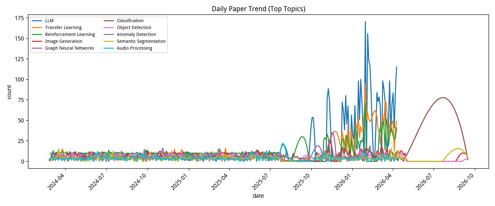
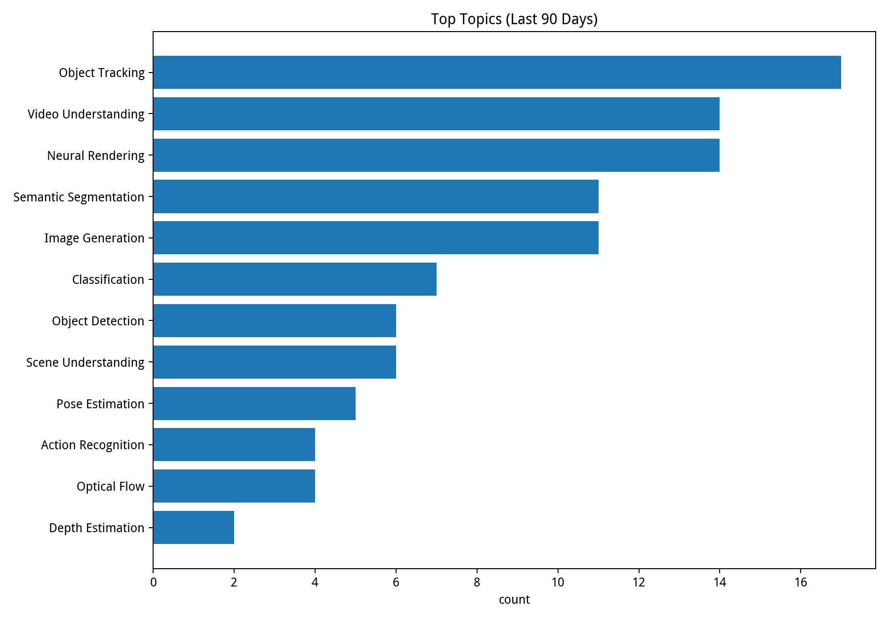
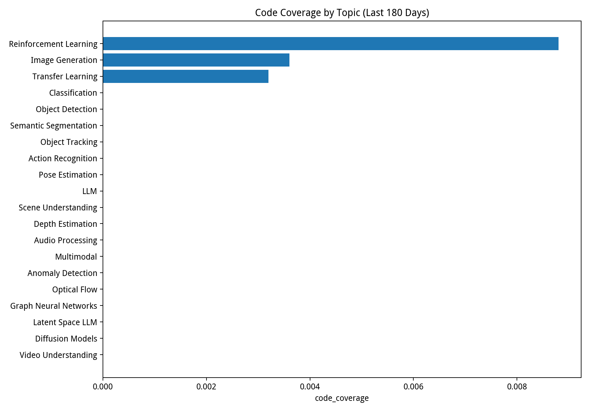
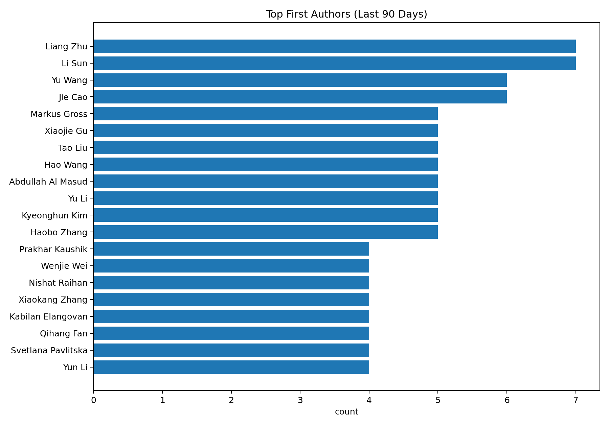

[](https://github.com/isLinXu/paper-list)<p align="center"><h1 align="center"><br><ins>Paper-List-DAILY</ins><br>每日自动更新的论文列表</h1></p>
## 最后更新于 2026.05.14


## 项目简介

本仓库提供每日更新的 arXiv 计算机视觉及人工智能领域论文列表，并按主题进行分类整理。每日更新由 GitHub Actions 自动化执行，帮助您及时掌握前沿研究动态。

在线文档：[https://islinxu.github.io/paper-list/](https://islinxu.github.io/paper-list/)

## 数据分析

- 数据面板：[docs/analytics/](docs/analytics/)









## 使用方法

若要在本地生成论文列表，请执行以下步骤：

1. **安装依赖**
   ```bash
   pip install -r requirements.txt
   ```

2. **运行脚本**
   ```bash
   python get_paper.py
   ```

3. **自定义配置**
   您可以在 `config.yaml` 中自定义搜索关键词及其他设置。

### 进阶用法

您还可以使用 `scripts/` 目录下的脚本执行附加任务：

- **统计特定日期范围内的论文数量**：
  ```bash
  python scripts/count_range.py 2024-01-01 2024-12-31
  ```

## 论文列表

