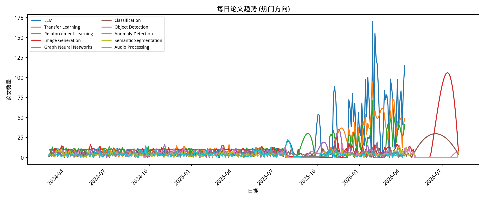
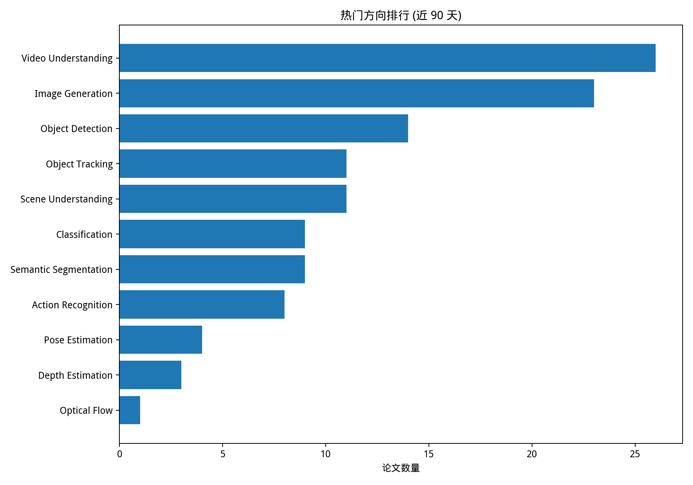
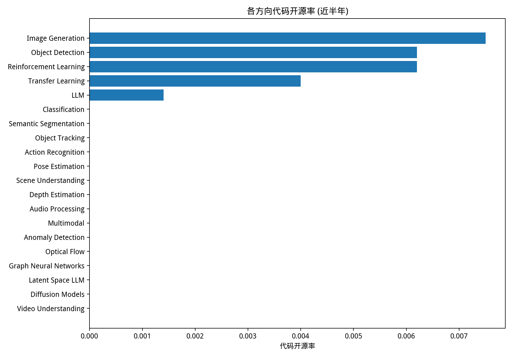

[](https://github.com/isLinXu/paper-list)<p align="center"><h1 align="center"><br><ins>Paper-List-DAILY</ins><br>每日自动更新的论文列表</h1></p>
## 最后更新于 2026.08.05


## 项目简介

本仓库提供每日更新的 arXiv 计算机视觉及人工智能领域论文列表，并按主题进行分类整理。每日更新由 GitHub Actions 自动化执行，帮助您及时掌握前沿研究动态。

在线文档：[https://islinxu.github.io/paper-list/](https://islinxu.github.io/paper-list/)

## 数据分析

- 数据面板：[analytics/](analytics/)







## 使用方法

若要在本地生成论文列表，请执行以下步骤：

1. **安装依赖**
   ```bash
   pip install -r requirements.txt
   ```

2. **运行脚本**
   ```bash
   python get_paper.py
   ```

3. **自定义配置**
   您可以在 `config.yaml` 中自定义搜索关键词及其他设置。

### 进阶用法

您还可以使用 `scripts/` 目录下的脚本执行附加任务：

- **统计特定日期范围内的论文数量**：
  ```bash
  python scripts/count_range.py 2024-01-01 2024-12-31
  ```

## 论文列表

  <ol>
    <li><a href=Classification.md>分类任务 (Classification)</a></li>
    <li><a href=Object_Detection.md>目标检测 (Object Detection)</a></li>
    <li><a href=Semantic_Segmentation.md>语义分割 (Semantic Segmentation)</a></li>
    <li><a href=Object_Tracking.md>目标跟踪 (Object Tracking)</a></li>
    <li><a href=Action_Recognition.md>动作识别 (Action Recognition)</a></li>
    <li><a href=Pose_Estimation.md>姿态估计 (Pose Estimation)</a></li>
    <li><a href=Image_Generation.md>图像生成 (Image Generation)</a></li>
    <li><a href=LLM.md>大型语言模型 (LLM)</a></li>
    <li><a href=Scene_Understanding.md>场景理解 (Scene Understanding)</a></li>
    <li><a href=Depth_Estimation.md>深度估计 (Depth Estimation)</a></li>
    <li><a href=Audio_Processing.md>音频处理 (Audio Processing)</a></li>
    <li><a href=Multimodal.md>多模态学习 (Multimodal)</a></li>
    <li><a href=Anomaly_Detection.md>异常检测 (Anomaly Detection)</a></li>
    <li><a href=Transfer_Learning.md>迁移学习 (Transfer Learning)</a></li>
    <li><a href=Optical_Flow.md>光流估计 (Optical Flow)</a></li>
    <li><a href=Reinforcement_Learning.md>强化学习 (Reinforcement Learning)</a></li>
    <li><a href=Graph_Neural_Networks.md>图神经网络 (Graph Neural Networks)</a></li>
    <li><a href=Latent_Space_LLM.md>潜空间与语言模型 (Latent Space LLM)</a></li>
    <li><a href=Diffusion_Models.md>扩散模型 (Diffusion Models)</a></li>
    <li><a href=Video_Understanding.md>视频生成与理解 (Video Understanding)</a></li>
    <li><a href=Neural_Rendering.md>神经渲染 (Neural Rendering)</a></li>
  </ol>
